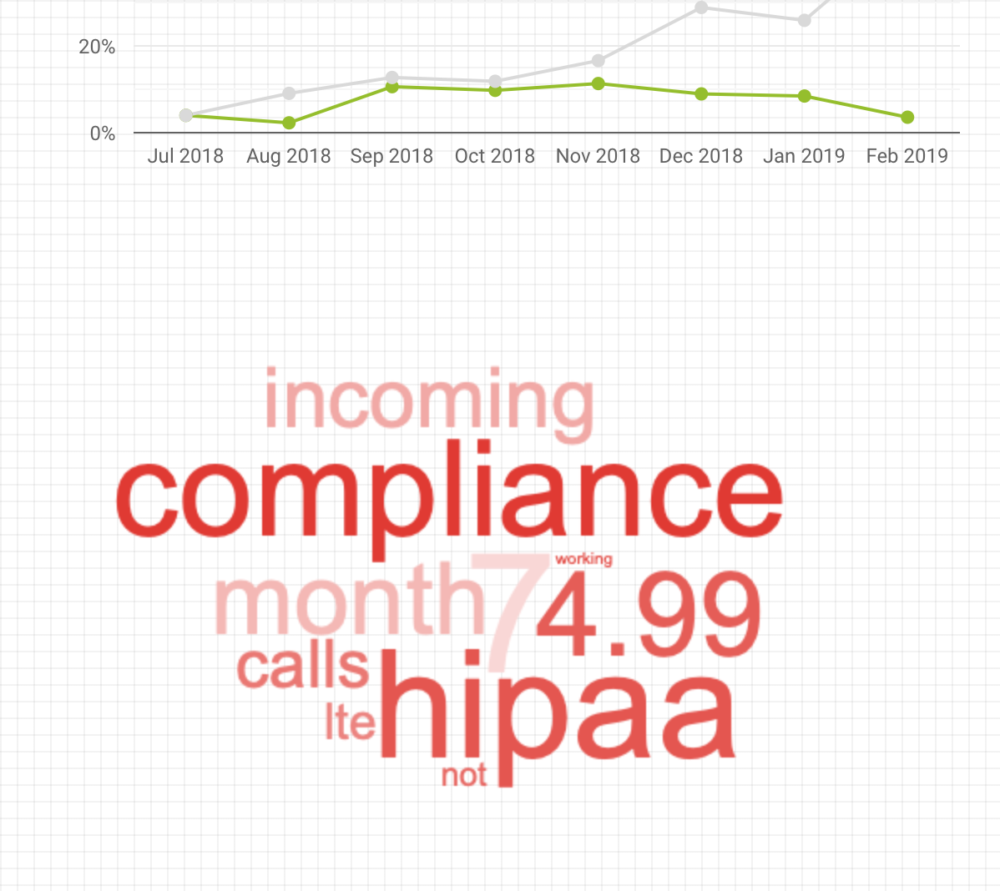
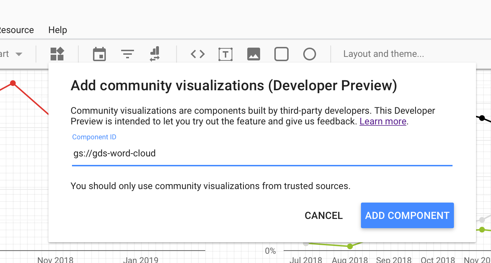
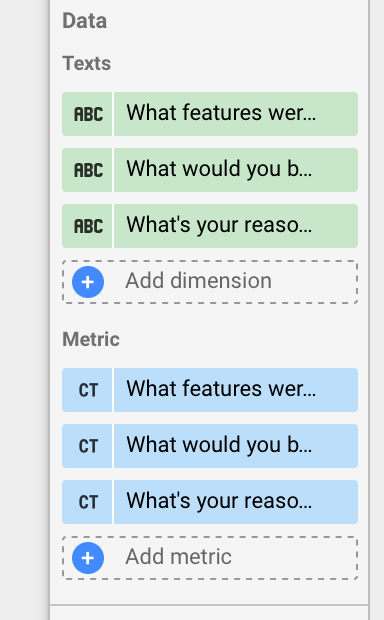

# GDS-Word-Cloud

Visualize word clouds easily in Google Data Studio

## Installation

Add a community visualization with either of the GDS-Word-Cloud distributions.

- **Dev**: `gs://gds-word-cloud-dev` Unstable. Changes made often.
- **Prod**: `gs://gds-word-cloud-prod` More stable. Should be good 👍

## Data

Unlike most data visualizations, word clouds don't have an *obvious* 2-dimensional relationship. That said, every GDS visualization requires a 2-dimensional data input: the values, and the "metrics".

For GDS-Word-Cloud, the data are any text fields in your data set (up to 5), which are merged into one body for processing.

The metrics are the `count` of those text fields. For most free-form text, this will always yield a `"text value": 1` relationship in the data, but for duplicates, the visualization considers it more prevalent (i.e. `"text value": 2` is processed as `"text value. text value"`).

Both of these fields *must* be present for the visualization to work properly.

## Style

The only exposed style variations are font color and family. Font family is fairly obvious, but font color works like this:

1. If no color is specified, use random colors depending on the `Show dark background` flag.
1. If a color is specified, use that color only.
  - If the `Vary colors slightly` flag is set, lighten or darken the color of each word, slightly, at random.
